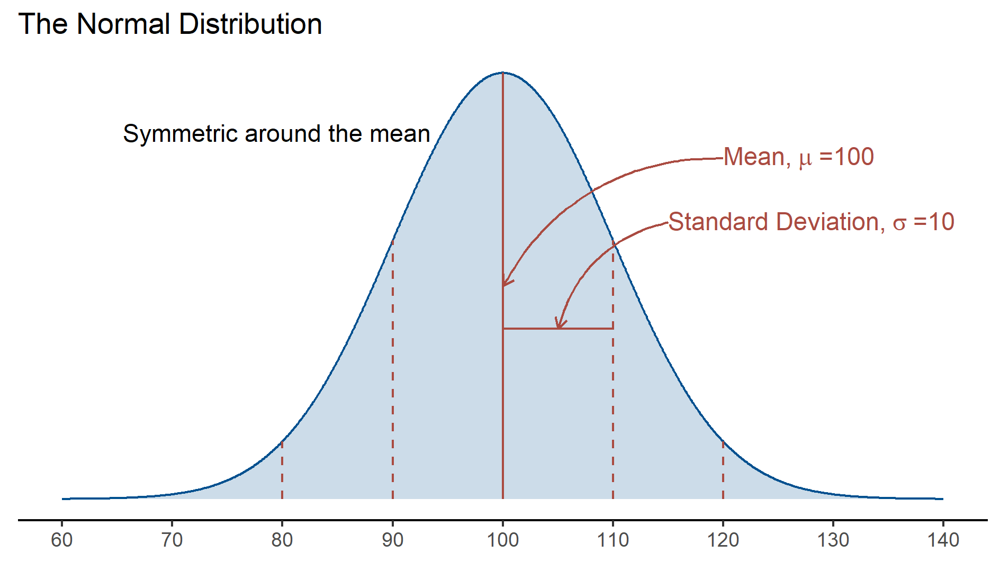
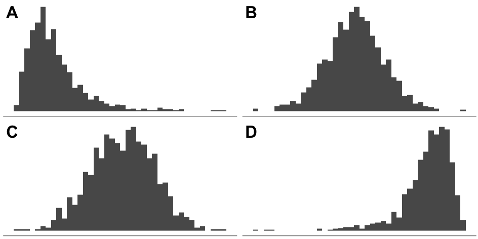
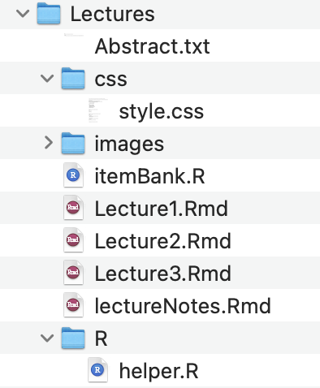
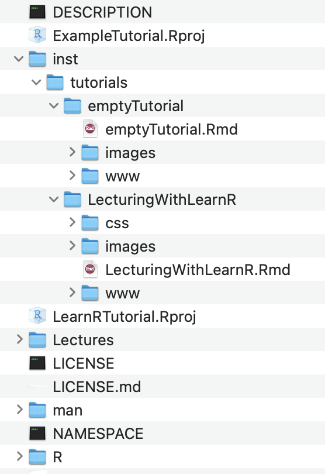

```{r setup, include=FALSE}
library(learnr)
library(tidyverse)
library(knitr)
knitr::opts_chunk$set(echo = FALSE,fig.align = 'center')
source('./www/helper.R')
imageDir <- paste0(dirname(rstudioapi::getSourceEditorContext()$path),
                   '/images/')

#---------------------------------------------
# These lines should be uncommented for development
createImages = FALSE # This should never be true, build the images separately
# However - if you want to create them all at once then change imageDir to:
# imageDir = 'images/' and recognise that all images will appear twice
imageDir = 'inst/tutorialsLecturingWithlearnr/images/'
devtools::load_all()
#---------------------------------------------

tutorial_options(exercise.eval = FALSE)

#---------------------------------------------
# Instructions for storing answers to the tutorials, not particularly useful for packaged tutorials
record_answers <- function(tutorial_id, tutorial_version, user_id, event, data) {
  cat(file=paste0(getwd(),'/answers.txt'),append=T,
      as.numeric(Sys.time()), ".", 
      tutorial_id, ".", tutorial_version, ": ", 
      user_id, ", ", 
      event, ", ", 
      data$label, ", ", 
      data$answer, ", ", 
      data$correct, "\n", sep = "")
}
options(tutorial.event_recorder = record_answers)
#---------------------------------------------


```

<!-- A Note on Printing Lecture and Tutorials:
Only those topics/elements that have been 'visited' will 
be printed. So if you haven't altered the UI then output
connected to that input won't be printed. To properly 
print to pdf, you need to have the css code below
Then: Run the document, Open in Browser and adjust all UI elements
Finally Ctrl+P from within the browser
-->
```{css print-tutorial-functionality}
@media print {
  @page {size: landscape}
  h2 {
    page-break-before: always;
  }
  .topicsContainer,
  .topicActions,
  .exerciseActions .skip {
    display: none;
  }
  .topics .tutorialTitle,
  .topics .section.level2,
  .topics .section.level3:not(.hide) {
    display: block;
  }
  .topics {
    width: 100%;
  }
  .tutorial-exercise, .tutorial-question {
    page-break-inside: avoid;
  }
  .section.level3.done h3 {
    padding-left: 0;
    background-image: none;
  }
  .topics .showSkip .exerciseActions::before {
    content: "Topic not yet completed...";
    font-style: italic;
  }
}

```

<!-- This chunk increases the text in the ace editor to make the code larger
It is especially useful for demonstrating code in lectures. -->

```{js}
$(function() {
var editor;
$('.ace_editor').each(function( index ) {
editor = ace.edit(this);
editor.setFontSize("20px");
});
})
```

## Overview

This talk is about how to extend your use of R & Rmarkdown {width=10%}

**Shiny Apps** are interactive applications written in R and output to HTML

**learnR Tutorials** can combine a variety of media (including Shiny Apps) within a navigable web-page

This tutorial will give an overview of:

- Example Shiny Apps & Resources
- Distributing Shiny Apps
- Incorporating interactive elements into tutorials
- Quiz elements
- Packaging Tutorials

`r emo::ji('question')` There shuold be plenty of` time for questions - please interrupt!

## Background

**Problems**  

1. Statistics lectures are not always riveting.
1. Statistics is best learned by **doing**, but it is difficult to provide practice within a lecture.

**Solution**

Bells!! Whistles!! Interactive Elements!!

{width="25%"}


## R Shiny

The [Shiny package](https://shiny.rstudio.com) takes care of all the fussy bits of web-based presentation so for R-users the learning curve is quite short.

```{r}
# Application title
titlePanel("Sample Application: Old Faithful Geyser Data")

sliderInput("bins",
            "Number of bins:",
            min = 1,
            max = 50,
            value = 30)

plotOutput("distPlot")

```

```{r svr1, context="server"}
output$distPlot <- renderPlot({
  # generate bins based on input$bins from ui.R
  x    <- faithful[, 2]
  bins <- seq(min(x), max(x), length.out = input$bins + 1)
  
  # draw the histogram with the specified number of bins
  hist(x, breaks = bins, col = 'darkgray', border = 'white', 
       main='Old Faithful Eruptions',
       xlab = 'Waiting time to next eruption (minutes)',
       xlim=c(0,100))
})
```

## UI and Output


:::: {style="display: flex;"}

::: {style="width: 50%"}
```{r}

titlePanel("Sample Shiny App: Geyser Data")

sliderInput("bins2",
            "Number of bins:",
            min = 1,
            max = 50,
            value = 30)

plotOutput("distPlot2")

```


```{r, context="server"}
output$distPlot2 <- renderPlot({
  # note the use of input$
  x    <- faithful[, 2]
  bins <- seq(min(x), max(x),length.out = input$bins2 + 1)
  
  # draw the histogram 
  hist(x, breaks = bins, col = 'darkgray', border = 'white', 
       main='Old Faithful Eruptions',
       xlab = 'Waiting time to next eruption (minutes)',
       xlim=c(0,100))
  
})
```

:::

::: {}
```{r}
# Add a little space
tags$p(HTML('&nbsp;&nbsp;'))
```

:::

::: {}

```{r,eval=F,echo=T}

titlePanel("Sample Shiny App: Geyser Data")

sliderInput("bins2",
            "Number of bins:",
            min = 1,
            max = 50,
            value = 30)

plotOutput("distPlot2")

```

```{r, context="server", eval=F, echo=T}
output$distPlot2 <- renderPlot({
  # note the use of input$
  x    <- faithful[, 2]
  bins <- seq(min(x), max(x), 
              length.out = input$bins2 + 1)
  
  # draw the histogram 
  hist(x, breaks = bins, 
       col = 'darkgray', border = 'white')
})
```


:::

::::

## Shiny Galleries

The beauty of R is that there is no need to re-invent the wheel

There are plenty of existing applications to choose from or to provide inspiration

The [RStudio Gallery](http://shiny.rstudio-staging.com/gallery/) 

<iframe src="http://shiny.rstudio-staging.com/gallery/" height="450" width="900" style="border: 1px solid #464646;" allowfullscreen="" allow="autoplay" data-external="1"></iframe>

## T-quan-T Shiny Gallery

[Tools for Teaching Quantitative Thinking](https://r.tquant.eu/)

<iframe src="https://r.tquant.eu/" height="450" width="900" style="border: 1px solid #464646;" allowfullscreen="" allow="autoplay" data-external="1"></iframe>

## Shiny Examples 

Shiny Applications are interactive, and can incorporate varying levels of navigation (panels, tabs etc). 

[Radiant App for Learning](https://vnijs.shinyapps.io/radiant/?SSUID=c901675ea6)

<iframe src="https://vnijs.shinyapps.io/radiant/?SSUID=fde4a0b277" height="500" width="900" style="border: 1px solid #464646;" allowfullscreen="" allow="autoplay" data-external="1"></iframe>

## Distributing Shiny Apps to Students

{width="10%"} Shiny apps are run on a Shiny Server. If you have the Shiny package installed then you can serve your apps on your laptop and easily incorporate them into lectures. 


But this doesn't allow students to interact with your app!

There are three options for running Shiny Apps:

- Limited free space on Shinyapps.io (5 shiny applications and 25 active hours per month with an academic account)
- Shiny Server free, runs on Linux servers, requires some technical know-how
- RStudio Connect paid option, no experience required

...or you can encapsulate your apps into tutorials with learnr {width="10%"}


## learnr
The [learnr package](https://rstudio.github.io/learnr/) encapsulates a variety of content into independent, interactive tutorials. 

{width="20%"}


- Lecture-style slides with text and graphics
- embedded videos (hosted on Vimeo and YouTube)
- embedded Shiny Apps for interactive explanation
- Quizes
- R coding exercises, with solutions
- iFrames for embedding other websites

## RStudio & Rmarkdown

{width="25%"} +
{width="25%"} =
{width="25%"}

### A Basic RMarkdown document
```yaml
---
title: "A Basic RMarkdown"
output: html_document
---
```

### A Shiny App (R script file)

```yaml
library(shiny)
# Define UI for application that draws a histogram
ui <- fluidPage(
# UI Elements: Title, Input etc
)
)
# Define server logic required to draw a histogram
server <- function(input, output) {
# Output functions: plots, tables, statistics
}
# Runs with the shinyApp command
shinyApp(ui = ui, server = server)
```

### A learnr Tutorial

```yaml
---
title: "A learnr Tutorial"
output:
learnr::tutorial:
css: css/style.css
runtime: shiny_prerendered
---


Text Interspersed with code chunks

---{r}
# User Interface Code
titlePanel("Sample Application: Old Faithful Geyser Data")

sliderInput("bins",
"Number of bins:",
min = 1,
max = 50,
value = 30)

plotOutput("distPlot")
---

---{r named-chunk, context="server"}
# Server Code
output$distPlot <- renderPlot({
# generate bins based on input$bins from ui.R
x    <- faithful[, 2]
bins <- seq(min(x), max(x), length.out = input$bins + 1)

# draw the histogram with the specified number of bins
hist(x, breaks = bins, col = 'darkgray', border = 'white', 
main='Old Faithful Eruptions',
xlab = 'Waiting time to next eruption (minutes)',
xlim=c(0,100))
})
---
```


## Lecture-Style Topics

Static images can be used as with any Rmarkdown

```{r build-normal-example,eval=createImages}
library(tidyverse)
my_theme <- ggplot2::theme_classic() +
  theme(axis.line.y = element_blank(),
        axis.ticks.y = element_blank(),
        axis.text.y = element_blank(),
        axis.title = element_blank())
mean_x=100
sd_x=10
range_x=4*sd_x

plotdata=tibble(x=seq(mean_x-range_x,mean_x+range_x,length.out = 1000),
                y=dnorm(x,mean_x,sd_x))
ggplot(plotdata, aes(x = x,y=y)) + 
  geom_line(col=style.env$plot_colour[1]) +
  geom_ribbon(aes(ymin=0,ymax=y,x=x),fill=style.env$plot_colour[1],alpha=.2)+
  scale_x_continuous(breaks=  seq(mean_x-range_x,mean_x+range_x,sd_x),limits=c(mean_x-range_x,mean_x+range_x)) +
  annotate('segment',
           x=mean_x,xend = mean_x,y=0,yend=max(plotdata$y),colour=style.env$plot_colour[2])+
  annotate(geom = "curve", 
           x = mean_x+2*sd_x, y = .8*max(plotdata$y), xend = mean_x, yend = .5*max(plotdata$y), 
           curvature = .3, arrow = arrow(length = unit(2, "mm")),colour=style.env$plot_colour[2]) +
  annotate(geom = "text", x =mean_x+2*sd_x, y =.8*max(plotdata$y), 
           label = deparse(bquote('Mean,'~mu~'=100')), hjust = "left",colour=style.env$plot_colour[2],size=4,parse=T) +
  annotate('segment',
           x=mean_x+sd_x,xend = mean_x+sd_x,y=0,yend=dnorm(mean_x+sd_x,mean_x,sd_x),
           colour=style.env$plot_colour[2],lty=2) +
  annotate('segment',
           x=mean_x-sd_x,xend = mean_x-sd_x,y=0,yend=dnorm(mean_x+sd_x,mean_x,sd_x),
           colour=style.env$plot_colour[2],lty=2) +
  annotate('segment',
           x=mean_x+2*sd_x,xend = mean_x+2*sd_x,y=0,yend=dnorm(mean_x+2*sd_x,mean_x,sd_x),
           colour=style.env$plot_colour[2],lty=2) +
  annotate('segment',
           x=mean_x-2*sd_x,xend = mean_x-2*sd_x,y=0,yend=dnorm(mean_x+2*sd_x,mean_x,sd_x),
           colour=style.env$plot_colour[2],lty=2) +
  annotate('segment',
           x=mean_x,xend = mean_x+sd_x,y=.4*max(plotdata$y),yend=.4*max(plotdata$y),
           colour=style.env$plot_colour[2]) +
  annotate(geom = "curve", 
           x = mean_x+1.5*sd_x, y = .65*max(plotdata$y), xend = mean_x+.5*sd_x, yend = .4*max(plotdata$y), 
           curvature = .3, arrow = arrow(length = unit(2, "mm")),colour=style.env$plot_colour[2]) +
  annotate(geom = "text", x =mean_x+1.5*sd_x, y =.65*max(plotdata$y), 
           label = deparse(bquote('Standard Deviation,'~sigma~'=10')), hjust = "left",colour=style.env$plot_colour[2],size=4,parse=T) +
  annotate(geom='text',
           x =mean_x-.65*sd_x, y =plotdata$y[which(round(plotdata$x)==round(mean_x-.5*sd_x))[1]],
           label = 'Symmetric around the mean',hjust='right') +
  my_theme + ggtitle('The Normal Distribution')

ggsave(filename = paste0(imageDir,'normal_example.png'),height=90,width=160,units='mm')

```

{width="95%"}

In fact, existing Rmarkdown documents can easily be converted to learnr tutorials by simply updating the yaml header to change the output. Xaringan slides take a bit more effort...

## Dynamic Images

Or shiny elements can be embedded to allow manipulation of graphs during the lecture.

> You can explore the properties of the normal distribution by changing the mean ($\mu$) and standard deviation ($\sigma$). Note that most of the area under the curve is within 3 standard deviations of the mean.

```{r normal-user-input, echo=FALSE}
# table
tags$table(width = "100%",
           # row
           tags$tr(width = "100%",
                   # Left cell: plot
                   tags$td(width='75%',align="left",
                           plotOutput("normalCurve",height = 300),
                           # Right cell: input ! Imporant! This should be given class 'well'
                           tags$td(width='25%',align="left",class="well",
                                   # New table to contain the input
                                   tags$table(width = "100%",
                                              # row 1
                                              tags$tr(width = "100%",
                                                      
                                                      tags$td(align="left",
                                                              numericInput("m",
                                                                           'Mean:',
                                                                           min = 10,
                                                                           max = 90,
                                                                           value = 50))),
                                              # row 2
                                              tags$tr(width = "100%",
                                                      
                                                      tags$td(align="left",
                                                              numericInput("s",
                                                                           "Standard Deviation:",
                                                                           min = 1,
                                                                           max = 30,
                                                                           value = 10))),
                                              # row 3
                                              tags$tr(width = "100%",
                                                      
                                                      tags$td(align="left",
                                                              checkboxInput("showSD",
                                                                            "Show Standard Deviations"
                                                              ))))))))

# Or this is tidier code, but uglier output
# numericInput("m",
#              'Mean:',
#              min = 10,
#              max = 90,
#              value = 50)
# numericInput("s",
#              "Standard Deviation:",
#              min = 1,
#              max = 30,
#              value = 10)

# plotOutput("normalCurve",height = 300)
```

```{r normal-user-output, context="server"}
output$normalCurve <- renderPlot({
  # reduce base graphic margins to (roughly) match ggplot
  par(oma=c(1,0,0,0),mar=c(2.1,0,plot_mtext_cex,0))
  
  plot_mean=input$m
  plot_sd=input$s
  x   <- seq(0,100,length=1000)
  y   <- dnorm(x,mean=plot_mean, sd=plot_sd)
  
  plot(x,y, type="l", lwd=1,axes=F,ylab="",xlab="")
  axis(1,at=seq(0,100,10), labels=seq(0,100,10))
  polygon(c(x, max(x),min(x)), 
          c(y,0,0), col=style.env$plot_colour[1])
  
  if (input$showSD) {
    for (i in seq(-3,3,1)){
      xLine=i*plot_sd+plot_mean
      segments(xLine,0,xLine,dnorm(xLine,mean=plot_mean, sd=plot_sd),lty=2,lwd=2,
               col=style.env$contrast_plot_colour)
    }
    # This draws the mean in a solid line
    segments(plot_mean,0,plot_mean,dnorm(plot_mean,mean=plot_mean, sd=plot_sd),lwd=2,
             col=style.env$contrast_plot_colour)
  }
  
})
```


## Multiple Outputs


```{r z-user-input, echo=FALSE}
withMathJax() # Allows latex
# table
tags$table(width = "100%",
           # Row 1 plot & user input
           tags$tr(width = "100%",
                   # Left cell: plot
                   tags$td(width='75%',align="left",
                           plotOutput("Xplot",height = 200)),
                   # Right cell: input ! Imporant! This should be given class 'well'
                   tags$td(width='25%',align="left",class="well",
                           tagList(numericInput("m2",'Mean:', min = 10, max = 90,value = 50),
                                   numericInput("s2", "Standard Deviation:",min = 1,max = 30,value = 10)
                           ))),
           # Row 2 - Slider Input
           tags$tr(width = "100%",
                   # Left cell: slider input
                   tags$td(width='75%',align="left",
                           sliderInput('x_val', 'Choose a value x, to compute a z-score for:', 0, 100, 50, step = 1)
                   )),
           
           # Row 3 - Z plot & Z score
           tags$tr(width = "100%",
                   # Left cell: Z plot
                   tags$td(width='75%',align="left",
                           plotOutput("Zplot",height = 200)),
                   # Right cell: Z score (embedded in another table)
                   tags$td(width='25%',align="center",
                           tagList(tags$p('$$Z=\\frac{x-\\mu}{\\sigma}$$')),
                                   uiOutput('z_formula'),
                                   htmlOutput('z_val')
                           )
           )
)

```

```{r z-user-output, context="server"}
# plots
output$Xplot <- renderPlot({
  
  # reduce base graphic margins to (roughly) match ggplot
  par(oma=c(1,0,0,0),mar=c(2.1,0,plot_mtext_cex,0))
  
  x   <- seq(0,100,length.out = 1000)
  y   <- dnorm(x,mean=input$m2, sd=input$s2)
  
  plot(x,y, type="l", lwd=1,axes=F,ylab="",xlab="")
  polygon(c(min(x),x, max(x),min(x)),
          c(0,y,0,0), col=style.env$plot_colour[1])
  points(input$x_val,y=max(y)/25,bg=style.env$plot_colour[2],col=style.env$contrast_plot_colour,pch=21,cex=3)
  
  axis(1,at=seq(0,100,10),labels=seq(0,100,10))
  
  mtext('Random Variable X',col=style.env$plot_colour[1],cex=plot_mtext_cex,adj = 0)
  mtext(bquote(mu == .(input$m2) *" , "~ sigma == .(input$s2)),col=style.env$plot_colour[1],cex=plot_mtext_cex)
  
}) # end X Plot

output$Zplot <- renderPlot({
  # reduce base graphic margins to (roughly) match ggplot
  par(oma=c(1,0,0,0),mar=c(2.1,0,plot_mtext_cex,0))
  
  lower_Z = (0-input$m2)/input$s2
  upper_Z =(100-input$m2)/input$s2
  xZ = seq(lower_Z,upper_Z,length=1000)
  z   <- dnorm(xZ,mean=0, sd=1)
  plot(xZ,z, type="l", lwd=1,axes=F,ylab="",xlab='')
  polygon(c(min(xZ),xZ, max(xZ),min(xZ)),
          c(0,z,0,0), col=style.env$plot_colour[2])
  
  points(x=(input$x_val-input$m2)/input$s2,y=max(z)/25,bg=style.env$plot_colour[1],col=style.env$contrast_plot_colour,pch=21,cex=3)
  axis(1,at=seq(round(lower_Z),round(upper_Z),length.out = 11),labels=seq(round(lower_Z),round(upper_Z),length.out = 11))
  mtext("Standard Normal Z ",col=style.env$plot_colour[2],cex=plot_mtext_cex, adj=0)
  mtext(bquote(mu == 1~" , "~ sigma == 0),col=style.env$plot_colour[2],cex=plot_mtext_cex)
}) # end Z plot

# This output is not yet working
x = reactive(input$xval)
m = reactive(input$m2)
s = reactive(input$s2)

output$z_formula <-renderUI({
  formula <- "$$Z-score = \\frac{%.0f - %.0f }{%.0f }$$"
  text <-sprintf(formula,x(),m(),s())
  withMathJax(
    tags$p(text)
  )
}) # End Z formula ()

output$z_val <-renderText({
  paste("<font color='",style.env$plot_colour[2],"'><p><b>",
        'Z-score = ',format(round((input$x_val-input$m2)/input$s2,2),nsmall = 2),
        "</b></p></font>")
}) # End Z value ()

```


## R Coding

R functions can be used to automate repetitive tasks

```{r ex-function, exercise=TRUE,exercise.lines =17}
calc_z_IQ <- function(x){
  m=100
  s=15
  z = (x-m)/s
  return(z)
}

calc_IQ_centile <- function(IQ){
  zscore <- calc_z_IQ(IQ)
  pnorm(zscore,lower.tail = T)  
}
# Calculate Z score then probability
calc_z_IQ(110)
pnorm(.67,lower.tail = T)
# Calculate Probability Directly
calc_IQ_centile(110)
```

## More Dynamic Images

**Drag the selector to find the probability on the right.**
```{r Z-prob-input, echo=FALSE}
sliderInput('zVal', '', -4, 4, 0, step = .1)
plotOutput("Zprob",height = 300)
```

```{r Z-prob-output, context="server"}
style.env$plot_colour[1]='#00508F'
plot_mtext_cex=1.2
output$Zprob <- renderPlot({
  zVal= input$zVal
  x   <- seq(-4,4,length=1000)
  y   <- dnorm(x)
  par(mar = c(2.1,0,1.1,0)) # removed left/right margins
  plot(x,y, type="l", lwd=1,axes=F,ylab="",xlab="")
  polygon(c(zVal,x[x>zVal],4, zVal), 
          c(0,y[x>zVal],0,0), col=style.env$plot_colour[2])
  axis(1,at=seq(-4,4,length.out=9), labels=seq(-4,4,length.out=9))
  mtext(paste('Probability Z >',zVal,'=',round(pnorm(zVal,lower.tail = F),3)),adj=1,col=style.env$plot_colour[2],cex=plot_mtext_cex)
  mtext(paste('Probability Z <',zVal,'=',round(pnorm(zVal),3)),cex=plot_mtext_cex,col=style.env$plot_colour[1],adj=0)
  
  polygon(c(zVal,-4,x[x<zVal], zVal), 
          c(0,y[x<zVal],0,0), col=style.env$plot_colour[1])
  
  text(x=2.8,y=.5*dnorm(0),labels=paste0('R code:\n pnorm(',zVal,',lower.tail=FALSE)'),adj=c(0.5,0),family='Courier',cex=1.5)
  # place the end of the right arrow halfway through the 'red' probability
  x_end = mean(c(3,zVal))
  arrows(x0=3,y0=.48*dnorm(0),x1=x_end,y1=.5*dnorm(x_end),lwd=2)
  text(x=-3,y=.5*dnorm(0),labels=paste0('R code:\n pnorm(',zVal,')'),adj=c(0.5,0),family='Courier',cex=1.5)
  # place the end of the left arrow halfway through the 'white' probability
  x_end = mean(c(-3,zVal))
  arrows(x0=-3,y0=.48*dnorm(0),x1=x_end,y1=.5*dnorm(x_end),lwd=2)
  
})
```

## Coding with Embedded Solution
You may want to store the solution to your code, just in case of time constraints or terribly typing ability

<!--Block Quotes are set to have a larger size and can come in handy sometimes -->
> IQ is approximately normally distributed with mean 100 and standard deviation 15. Jack's IQ is 104 and Jill's IQ is 129. Write a function to calculate a z-score for any IQ score and then use it to calculate Z-scores for Jack's and Jill's IQ.

```{r exc-function-2, exercise=TRUE,exercise.lines = 10}

```

```{r exc-function-2-solution}
get_z_score <- function(iq) {
  z = (iq-100)/15
  return(z)
}
# Jill
get_z_score(129)
# Jack
get_z_score(104)
```

<span class="learnr">Learn R:</span> Now update your function to allow a z-score to be calculated for any normal distribution (hint: it should have three arguments)

```{r exc-calc-z-any, exercise=TRUE,exercise.lines = 5}

```

```{r exc-calc-z-any-solution}
get_z_score <- function(x,mean,sd) {
  z = (x-mean)/sd
  return(z)
}
```

## Embedded Video

Seemlessly embed videos (or other web-based content) into lectures


## Recap: learnr for Lectures

Rmarkdown handles the layout so your can dedicate your energy to content.

All the capabilities of Rmarkdown plus:

+ interactive elements 
+ live R coding
+ embedded videos/web-content

= Engaged Students?


## Asynchronous Tutorials
As well as being a handy tool for lectures and presentations, learnr documents can be distributed to students as stand-alone tutorials

Distributing tutorials to students allows them to interact with your content.

These tutorials can be used for:

- 'Flipped Classroom' learning
- Practice quizzes
- R coding tasks
- providing access to video clips
- complete online courses

## R Coding Tasks
<span class="learnr">Learn R:</span> Use R to calculate the Z score for $x=10$, where $X$ is normally distributed random variable with $\mu=20$ and $\sigma=4$:
```{r exc-calc-z, exercise=TRUE,exercise.lines = 4}

```

```{r exc-calc-z-solution}
(10-20)/4
```

```{r quiz-2}
quiz(caption='Quick Quiz',
     question("What is the Z-score for a score of 70 on a normally distributed variable with mean of 100 and standard deviation of 10? (Use the code box above for the calculation)",
              answer("3",message='All score below the mean have negative Z scores'),
              answer("30", message='Check the formula on the previous page'),
              answer("-3", correct = TRUE),
              answer("70",message='Check the formula on the previous page')
     )
)
```

## Quiz 1

{width="50%"}


```{r create-normal-quiz-plot,eval=createImages}
library(ggpubr)
# Defining a custom ggplot theme
my_theme <- ggplot2::theme_classic(base_size = 2) +
  theme(axis.line.y = element_blank(),
        axis.ticks.x = element_blank(),
        axis.ticks.y = element_blank(),
        axis.text.y = element_blank(),
        axis.text.x = element_blank(),
        axis.title = element_blank()) 

n=1000
plotdata=tibble(
  A = rlnorm(n,mean=3,.5),
  B= rnorm(n,mean=30,sd=5),
  C = rnorm(n,mean=60,sd=15),
  D = 100-rlnorm(n,mean=3,.5),
)

plots<-NULL
for (var in LETTERS[1:4]){
  plots[[var]] <- plotdata %>%
    ggplot(aes_string(x=var)) +
    geom_histogram(bins = 40) +
    my_theme
}
ggarrange(plotlist=plots,labels = LETTERS,font.label = list(size = 8))

ggsave(filename=paste0(imageDir,'normal_plot_quiz.png'),width=8,height=4,units='cm')

```

```{r quiz1}
# NOTE: quiz chunks MUST be names
#--------------------------------------------------------
# Here is a useful link to example questions:
# https://pkgs.rstudio.com/learnr/articles/questions.html

# The first question allows a retry
# The second question will appear in a random order
quiz(caption='',
     question("Which of the above plots are Normally distributed?",
              answer("A",message='A is right skewed'),
              answer("B", correct = TRUE),
              answer("C", correct = TRUE),
              answer("D",message='D is left skewed'),
              allow_retry = TRUE
     ),
     question("What is the mean of the standard normal distribution? (Will appear in random order)",
              answer("-100"),
              answer("100"),
              answer("0", correct = TRUE),
              answer("-50"),
              answer("50"),
              random_answer_order = TRUE,
              allow_retry = TRUE
     )
)
```


## Quiz 2

Random values can be incorporated into the questions and answers, to make quizzes different for each student. 

In addition to random values, the answers can appear in a random order (this is a argument that you set in the question function).

```{r quiz-1}
# This provides one example of how to create questions with a random element

#---------------------------------------------
# heart rate question variables 
m=floor(runif(1,60,75))
s=floor(runif(1,7,14))
bpm=floor(rnorm(1)*s+m)
qHeartRate = paste0("If heart rate in a special patient population is Normally distributed with a mean of ",m,
                    " and a standard deviation of ",s,
                    ", what is the probability that a person in this group will have a heart rate greater than ",
                    bpm,"?")
a1 = rnd(pnorm(bpm,m,s,lower.tail = F),3)
a2 = rnd(pnorm(bpm,m,s,lower.tail = T),3)
a3 = rnd(abs(bpm-m)/s,3)
a4 = paste0('-',a3)
a5 = rnd(pt((bpm-m)/s,df=10,lower.tail = F),3)
#---------------------------------------------

quiz(caption='Quiz on the Normal distribution',
     
     question(qHeartRate,
              answer(a1, correct=TRUE ),
              answer(a2),
              answer(a3),
              answer(a4),
              answer(a5),
              random_answer_order=T,
              allow_retry = TRUE
     )
     
)
```

## Quiz 3 

This quiz also uses random values. You could write an item bank to distribute to provide additional practice.
```{r quiz3}
hr_m <- as.integer(rnorm(1,70,4))
hr_s <- as.integer(rnorm(1,10,2))
x_val <- as.integer(rnorm(1,hr_m,hr_s))
z_val = (x_val-hr_m)/hr_s
p_above = pnorm(z_val,lower.tail = F)
p_below = pnorm(z_val,lower.tail = T)
lb <- round(qnorm(.25,hr_m,hr_s),1)
ub <- round(qnorm(.75,hr_m,hr_s),1)

quiz(caption = sprintf('Assume that the distribution of heart rate (bpm) for healthy adults at rest follows a Normal distribution with mean ($\\mu$) of %1.0f and standard deviation ($\\sigma$) of %1.0f.',hr_m,hr_s),
     question(sprintf('What percentage of healthy adults at rest have heart rate (bpm) values above %1.0f?',x_val),
              answer(sprintf('%1.0f%%' ,100*p_above), correct=TRUE),
              answer(sprintf('%1.0f%%' ,100*p_below), message='This is the proportion with values below the value of interest.'),
              answer(sprintf('%1.2f' ,z_val), message='That is the z-score, not the probability'),
              answer(sprintf('%1.2f' ,-z_val)), 
              answer(sprintf('%1.0f%%' ,100*ifelse(p_below<.5,.5-p_below,p_below-.5))),
              answer(sprintf('%1.0f%%' ,100*p_above/2)),
              allow_retry = TRUE,
              random_answer_order = T),
     question('Between what two values do the middle 50% of heart rate (bpm) values lie?',
              answer(sprintf('%1.0f and %1.0f',lb,ub), correct=TRUE),
              answer('-0.67 and 0.67', message='These are the z-scores that contain the middle values.'),
              answer(sprintf('%1.0f and %1.0f',x_val-hr_s,x_val+hr_s)),
              answer(sprintf('%1.0f and %1.0f',x_val-.5*hr_s,x_val+-.5*hr_s)),
              answer(sprintf('%1.0f and %1.0f',x_val-2*hr_s,x_val+2*hr_s)),
              allow_retry = TRUE,
              random_answer_order = T)
)
```

## Storing Quiz Answers

A function can be defined to record submitted answers. This should be included in the `setup` code chunk.

```{r, eval=F,echo=T}
# Instructions for storing answers to the tutorials 
# (not particularly useful for packaged tutorials)
record_answers <- function(tutorial_id, 
                           tutorial_version, 
                           user_id, event, data) {
  cat(file='answers.txt'),append=T,
  as.numeric(Sys.time()),
  tutorial_id, " (", tutorial_version, "): ", 
  user_id, ", ", event, ", ", 
  data$label, ", ", data$answers, ", ", 
  data$correct, "\n", sep = "")
}
options(tutorial.event_recorder = record_answers)
```

Answers.txt content:

```yaml
1646686868.lRt.2022.lwlr.1: lisa, session_start, , , 
1646686874.lRt.2022.lwlr.1: lisa, question_submission, quiz-1-1, The mean and the standard deviation, TRUE
1646686880.lRt.2022.lwlr.1: lisa, question_submission, quiz-1-2, The area under the curve is the total amount of variation, FALSE
1646686928.lRt.2022.lwlr.1: lisa, question_submission, quiz-1-3, 0.159, TRUE
1646686930.lRt.2022.lwlr.1: lisa, session_stop, , , 
```

## Printing to PDF

To print the tutorial to pdf requires an @media rule. This is included as a `css chunk` within the markdown document.

This allows you to:

- set the orientation
- define where page breaks occur
- remove the navigation bar and just print content
- remove any background images and generally tidy things

`r emo::ji('exclamation')`Only tutorial pages that have been visited will be printed.`r emo::ji('exclamation')` 

<details><summary>Click here for css print code</summary>

```css
@media print {
@page {size: landscape}
h2 {
page-break-before: always;
}
.topicsContainer,
.topicActions,
.exerciseActions .skip {
display: none;
}
.topics .tutorialTitle,
.topics .section.level2,
.topics .section.level3:not(.hide) {
display: block;
}
.topics {
width: 100%;
}
.tutorial-exercise, .tutorial-question {
page-break-inside: avoid;
}
.section.level3.done h3 {
padding-left: 0;
background-image: none;
}
.topics .showSkip .exerciseActions::before {
content: "Topic not yet completed...";
font-style: italic;
}
}
```

</details>


## Workflow

How can learnr be used in teaching?

1. Tutorials as dynamic lecture slides

- interactive elements
- demonstrating R code
- including multimedia

2. Development of tutorial packages for asynchronous learning

- allows for student interaction
- can incorporate random elements
- can include quizzes
- requires a distribution method (github)

These different end goals require slightly different development workflows. 

It is easiest to begin with tutorials intended for use as presentations or lecture slides.

## Dynamic Lecture Slides

One lecture will be a single tutorial document, with a topic for each slide

Similar structure to slide creation with Beamer or Xaringan, but elements can be dynamic

- graphs can be changed based on UI
- variables can be altered to affect an equation
- R coding techniques can be demonstrated

All lectures can be stored in a single folder with shared dependencies



## Tutorial Package for Asynchronus Learning

All tutorials are contained in an **R package**

Each tutorial has its own set of dependencies, tutorials are sandboxed

**However** during development, all tutorials can access the shared resources, 
which can then be copied across to the tutorial folders.

Package can easily be updated and distributed to students via github



## Download this Tutorial

This tutorial is in my ExampleTutorial package, available on my gitHub page

You can run the tutorial by installing the package

...but better still, download the folder to start quickly developing your own tutorials

Enjoy `r emo::ji('smile')` 


